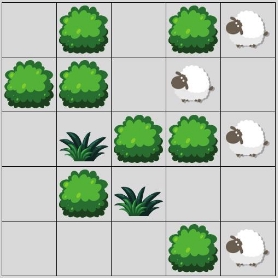

**Pr2 – Projet de programmation 2**

L1 Informatique & L1 Mathématiques

2021-2022

**Projet de programmation: Ricosheep**

L’objectif de ce projet est d’implémenter un petit jeu de type “puzzle” et un algorithme de recherche automatique de solutions.

**Le jeu Ricosheep**

Ricosheep est un jeu de type casse-tête, inspiré principalement des jeux *Ricochet Robots* et *2048*. Le jeu se joue sur une grille remplie de moutons, de touffes d’herbe, de buissons et de cases vides, comme celle présentée ci-dessous :

**Fig. 1 :** une partie de Ricosheep en cours.

Le jeu se joue en *tours* successifs. À chaque tour, le joueur peut déplacer les moutons de la façon suivante :

- Le joueur donne une instruction aux moutons, en choisissant une direction parmi Haut, Bas, Gauche ou Droite.
- Les moutons se déplacent *en troupeau* : **tous** les moutons suivent l’instruction donnée.
- Les moutons sont *têtus* : ils effectuent le déplacement **maximal** dans la direction donnée, c’est-à-dire qu’ils continuent à avancer jusqu’à être bloqués par un buisson, le bord du plateau ou un autre mouton qui est lui-même bloqué. En particulier, les touffes d’herbe ne bloquent pas le déplacement des moutons.
- Les moutons ne se superposent pas : deux moutons ne peuvent pas occuper la même case.

Le but du jeu est de placer un mouton sur chaque touffe d’herbe. Si le joueur y parvient, la partie

est *gagnée*. Le joueur peut essayer de résoudre le casse-tête autant qu’il le souhaite. Toutefois, comme certains coups ne sont pas réversibles, il est possible que le joueur *perde* la partie en menant les moutons à une position qui ne permettra plus de gagner.

Dans l’exemple ci-dessous, le joueur peut facilement gagner en emmenant ses moutons vers le bas. S’il se trompe et guide les moutons à gauche, il devient alors impossible de gagner.

**Objectif**

L’objectif principal de ce projet est de réaliser un programme graphique permettant de jouer à Ricosheep. L’utilisateur pourra, tour après tour, donner une instruction aux moutons en appuyant simplement sur la flèche du clavier correspondant. Le moteur du jeu s’occupera de mettre à jour la position des moutons en respectant les règles de déplacement, et d’afficher le résultat sur la fenêtre du jeu. Finalement, l’interface indiquera au joueur quand la partie est terminée.

Outre l’implémentation du jeu lui-même, un deuxième objectif du projet réside dans la program- mation d’un *solveur*, ou générateur automatique de solutions. Étant donné une grille du jeu, le solveur devra en produire une solution, c’est-à-dire une séquence d’instructions à donner aux moutons, pour aller de l’état initial du jeu à la victoire.

**Réalisation**

Le projet se décompose en quatre tâches principales, toutes obligatoires. Les améliorations facultatives sont marquées d’un nombre d’étoiles (* ) correspondant approximativement à leur difficulté.

**Tâche 1: Réalisation du moteur de jeu**

**La première tâche du projet** consiste à programmer la logique interne du jeu, c’est-à-dire la partie qui permet de manipuler la structure de données utilisée pour simuler l’état du jeu et décider si la partie est terminée.

**Représentation de l’état du jeu**

L’état du jeu est représenté par deux types d’informations :

- Les éléments fixes : les dimensions de la grille, les positions des buissons et des touffes d’herbe ;
- Les éléments mobiles : les positions des moutons.

Une suggestion de structure de données à utiliser pour représenter ces informations est faite ci-dessous. Vous êtes toutefois libres d’en changer, **à condition d’expliquer et de motiver vos choix.**

Les éléments fixes sont représentés par une liste de listes plateau. Les dimensions de la grille correspondent aux dimensions des listes utilisées. La valeur plateau[i][j] indique l’élément qui se trouve dans la case i,j de la grille : None pour une case vide, 'G' pour une touffe d’herbe et 'B' pour un buisson.

Ainsi, la grille de la Fig. 1 est représentée par la liste de listes ci-dessous : plateau = [[None, 'B' , None, 'B' , None],

['B' , 'B' , None, None, None],

[None, 'G' , 'B' , 'B' , None],

[None, 'B' , 'G' , None, None],

[None, None, None, 'B' , None]]

Les positions des moutons sont représentées par une liste de paires moutons. Chaque élément de la liste est un couple (i,j) indiquant la présence d’un mouton à la ligne i et à la colonne j.

Dans la grille de la Fig. 1, les positions des moutons sont représentées par la liste suivante : moutons = [(0,4), (1,3), (2,4), (4,4)]

**Déplacement des moutons**

La principale fonctionnalité du moteur du jeu est de mettre à jour les positions des moutons après une instruction du joueur. Cette fonctionnalité sera assurée par une fonction jouer(plateau, moutons, direction) recevant en paramètre l’état du jeu et une direction représentée par la chaine 'Left', 'Right', 'Up' ou 'Down'. La fonction ne renvoie rien et met directement à jour

les positions des moutons dans la liste moutons en respectant les règles du jeu.

Les moutons se déplacent *en groupe* dans la direction indiquée jusqu’à rencontrer un obstacle. Un exemple de déplacement est donné ci-dessous.

Position initiale

Après un déplacement à gauche Après un déplacement à droite

**Déplacements efficaces (*** **) :** Il existe plusieurs approches plus ou moins efficaces pour ef- fectuer cette mise à jour. Bien que la complexité algorithmique ne soit pas l’enjeu principal de ce projet, une fonction jouer trop inefficace impactera fortement les performances du solveur, et en particulier du générateur de niveaux. Pour cette tâche facultative, essayez de proposer une fonction jouer dont la complexité algorithmique est en *O*(*nm*) où *m* est le nombre de moutons et *n* la plus grande dimension de la grille.

**Fin de partie**

Une partie de Ricosheep peut se terminer par la victoire ou la défaite du joueur. La partie est *gagnée* si un mouton se trouve sur chacune des touffes d’herbe. À l’inverse, la partie est *perdue* si le joueur emmène les moutons dans une position à partir de laquelle il ne lui est plus possible de gagner.

**Détection de la victoire :** la victoire sera détectée par une fonction victoire(plateau, moutons) renvoyant True si la partie est actuellement gagnée (chaque touffe d’herbe est couverte par un mouton) et False sinon.

**Détection de la défaite (*** **) :** la détection de la défaite ne fait pas partie des tâches obligatoires du projet. Pour détecter la défaite, il faut s’assurer *qu’aucune séquence de coups* ne permet de gagner à partir de la position actuelle. Il s’agit donc de vérifier que le solveur (Tâche 4) ne renvoie aucune solution à partir de la position actuelle. La difficulté principale provient du fait que ce calcul ne doit pas être perceptible par le joueur ni provoquer de ralentissement notable du jeu. Cette tâche nécessitera donc un programme de bonne qualité générale et un solveur performant.

**Tâche 2: Représentation et chargement des grilles**

Une grille de Ricosheep peut être représentée par un fichier texte comme suit:

$ cat map1.txt \_B\_BS

BB\_S\_

\_GBBS

\_BG\_\_

\_\_\_BS

(La ligne $ cat map1.txt ne fait pas partie du fichier.)

Ce contenu correspond à la grille de la Fig. 1. La grille est décrite case par case, de la gauche vers la droite puis du haut vers le bas. Chaque caractère du fichier décrit le contenu d’une des cases de la grille : \_ représente une case vide, Bun buisson (bush), Gune touffe d’herbe (grass) et S un mouton (sheep).

Le programme réalisé doit être capable de lire des fichiers écrits dans le format spécifié ci-dessus. Plus précisément, votre programme contiendra une fonction charger(fichier) recevant en paramètre le chemin d’accès d’un fichier et renvoyant les structures de données que vous aurez choisies lors de la tâche 1, correctement remplie avec les informations contenues dans le fichier.

La fonction renverra None si le fichier proposé n’est pas correctement formaté, par exemple si le fichier contient un caractère inattendu.

**Remarque :** une grille n’est pas forcément carrée, elle peut aussi avoir une forme rectangulaire.

**Tâche 3: Interface graphique**

Une interface ergonomique est attendue. Au lancement du programme, le joueur devra être accueilli par un menu lui permettant de charger une grille de son choix parmi un ensemble de grilles disponibles.

Une fois le jeu lancé, le joueur pourra jouer en indiquant les instructions grâce aux flèches directionnelles du clavier. À chaque coup joué, le programme se chargera de mettre à jour la position des moutons et l’affichage en conséquent.

Le joueur pourra recommencer la grille choisie depuis le début avec la touche R, et revenir au menu pour choisir une autre grille avec la touche Echap. Si le joueur parvient à résoudre la grille, un message de félicitations s’affichera et proposera au joueur de revenir au menu.

**Toute la partie graphique du projet doit être réalisée avec la bibliothèque fltk.**

**Tâche 4: Recherche de solutions**

La quatrième tâche du projet consiste à implémenter un algorithme de recherche automatique de solution, ou *solveur*, pour le jeu Ricosheep. Le rôle du solveur est de déterminer s’il est possible de gagner à partir d’un état du jeu donné. En cas de réponse positive, le solveur doit aussi fournir une *solution* à la grille, c’est-à-dire une liste des coups à jouer pour arriver à la victoire.

Nous allons commencer par implémenter un algorithme de recherche naïf (appelé algorithme de recherche *par backtracking*, ou algorithme de *recherche en profondeur*) qui, depuis un état donné du jeu, va essayer toutes les instructions possibles et rechercher récursivement une solution depuis chaque nouvel état obtenu. Cet algorithme est très similaire à celui vu en TD pour résoudre le *problème du sac à dos*.

Pour garantir que l’algorithme ne provoque pas d’appels récursifs infinis, nous allons nous assurer que chaque état du jeu est exploré au plus une fois. Pour ce faire, nous allons enregistrer chaque état visité dans un ensemble visite de type set et interrompre prématurément les appels récursifs sur des états déjà visités. Comme les buissons et touffes d’herbe ne sont jamais déplacés, il suffira d’enregistrer dans visite les positions des moutons.

L’algorithme procède comme suit, à partir de l’état du jeu donné par plateau et moutons et de l’ensemble initialement vide visite :

1. Si l’état du jeu est actuellement gagné, répondre [] : il n’y a rien à faire de plus.
1. Si l’état du jeu est déjà dans visite, répondre None. Cet état à déjà été considéré, on interrompt la recherche.
1. Sinon, on commence par ajouter l’état du jeu dans visite. Puis, pour chaque direction dans ['Left', 'Right', 'Up', 'Down'] :
- On calcule l’état atteint en jouant direction.
- On lance la recherche récursivement à partir de cet état.
- Si la recherche renvoie une solution S, on renvoie [direction] + S.
- Sinon, on annule le coup joué et on passe à la direction suivante.
4. Si aucune direction ne permet d’arriver à une solution, on déduit qu’il n’y a pas de solution à partir de l’état donné, et on renvoie None.

**Tâches complémentaires**

Cette section propose des améliorations du projet, à aborder uniquement si toutes les tâches obligatoires ont été *entièrement terminées*.

**( ) Solveur graphique**

Cette amélioration consiste à réaliser un mode graphique du solveur, avec deux nouvelles fonc- tionnalités :

- **Affichage de la recherche :** chaque état du jeu visité est affiché graphiquement sur la fenêtre. L’utilisateur peut alors suivre visuellement les calculs de l’algorithme jusqu’à la solution ou jusqu’à la conclusion qu’aucune solution n’existe. Les étapes de recherche peuvent être animées automatiquement (à une vitesse plus ou moins grande) ou s’afficher pas à pas par appui sur une touche.

Attention, l’affichage ralentit bien sûr énormément la recherche, c’est pourquoi cet affichage est seulement une **option** qu’il doit être facile de désactiver au besoin.

- **Affichage de la solution :** à la fin du calcul, le solveur affiche graphiquement la solution trouvée. Le jeu se lance dans les conditions habituelles, mais les déplacements des moutons sont contrôlés par le programme. Les moutons suivent alors pas à pas les instructions trouvées et montrent au joueur une solution menant à la victoire.

**( ) Recherche d’une solution minimale**

Il est possible (et même facile : amusez-vous à trouver un contre-exemple !) de prouver que les solutions produites par l’algorithme de recherche en profondeur ne sont pas nécessairement minimales en nombre de coups. En d’autres termes, ce n’est pas parce que l’algorithme de recherche en profondeur renvoie une solution en *n* coups qu’il ne peut pas en exister une autre nécessitant moins de coups.

Pour calculer une solution minimale à une grille donnée, nous allons adopter une nouvelle stratégie d’exploration des états du jeu, qui considère toutes les séquences de coups possibles par ordre de longueur. Cette méthode est traditionnellement appelée *recherche en largeur* (par opposition à la recherche en profondeur). On peut décrire cette stratégie comme suit (en reprenant les notations

de la Tâche 4) :

On déclare une liste a\_traiter que l’on remplit initialement avec la paire (etat, []), où etat est l’état du jeu donné en paramètre. Cette paire indique qu’il n’y a rien à faire pour atteindre l’état du jeu décrit par etat.

Tant que a\_traiter n’est pas vide :

1. On retire de a\_traiter **son premier élément**, une paire (etat, coups).
1. Si, dans etat, la partie est gagnée, on renvoie coups.
1. Si etat est déjà dans visite, on renvoie None.
1. Sinon, on commence par ajouter l’état du jeu dans visite. Puis, pour chaque direction dans ['Left', 'Right', 'Up', 'Down'] :
- On calcule l’état suivant atteint à partir de etat en jouant direction.
- On ajoute (suivant, coups + [direction]) **à la fin** de a\_traiter.

Si a\_traiter est vide, on renvoie None : tous les états accessibles ont été explorés sans trouver de solution.

Cet algorithme garantit que chaque état accessible est visité dans l’ordre du nombre minimal de coups nécessaires pour l’atteindre, jusqu’à ce qu’une solution soit trouvée. On peut bien sûr appliquer à cette méthode les mêmes raffinements qu’à la recherche en profondeur, afin de faire l’affichage graphique des états visités et jouer la solution trouvée.

**Autres améliorations suggérées**

Voici quelques autres suggestions d’améliorations moins détaillées. Attention, certaines sont plutôt faciles tandis que d’autres sont assez difficiles. N’hésitez pas à demander conseil à vos enseignants avant de vous lancer sur une de ces pistes.

- (* ) Permettre au joueur d’enregistrer une partie en cours ou de charger une partie enregistrée. L’enregistrement devra être fait dans un fichier de manière à pouvoir être récupéré lors d’une autre session de jeu. Il faut pour cela modifier le format de fichier pour prendre en compte le fait qu’un mouton peut se trouver sur une case contenant une touffe d’herbe.
- (* ) Ajouter une fonction ‘Annuler’, permettant au joueur d’annuler le dernier coup qu’il a joué. Cette fonction pourra être répétée autant que désiré, jusqu’à revenir à l’état initial.
- (* ) Ajouter des loups, dont vous choisirez les règles de déplacements. Lorsqu’un loup rencon- tre un mouton, la partie est perdue. **Vous adapterez votre solveur en conséquence.**
- (* ) Ajouter des herbe et moutons colorés : pour gagner, il faut que chaque touffe d’herbe soit couverte par un mouton de la même couleur. **Vous adapterez votre solveur en conséquence.**
- (*  ) Implémenter un générateur de grilles aléatoires résolubles (c’est-à-dire pour lesquels il existe une solution). **Cette amélioration nécessite un solveur correct.**
- (*  ) Implémenter un éditeur de grilles, c’est-à-dire une interface graphique permettant à l’utilisateur de choisir la dimension de la grille et où placer les moutons, buissons et herbes. Une fois la réalisation terminée, la grille sera enregistrée dans un fichier.
- (*   ) Implémenter un générateur de grilles aléatoires de difficulté choisie. L’utilisateur choisit les paramètres de la grille : dimensions, nombre de moutons, nombre de touffes d’herbe et longueur de la solution minimale, et votre programme génère une grille satisfaisant les contraintes demandées. **Cette amélioration nécessite un solveur en largeur correct.**

Toute autre amélioration est envisageable selon vos idées et envies, à condition d’en discuter au préalable avec un de vos enseignants.
8
